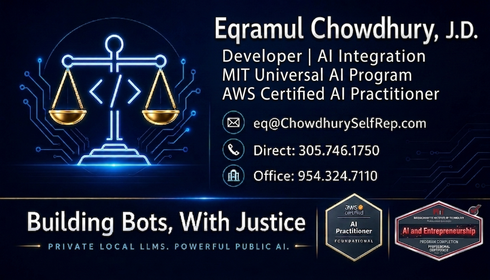

# Eqramul Chowdhury, J.D.

**Law-Developer** — a J.D. who passed the Florida Bar Examination and builds private, multimodal AI systems for legal operations and litigation document management.

Coral Gables–trained business & real estate litigation · Multimodal RAG · Legal document intelligence

---

## Who I am

I spent roughly fifteen years inside a Coral Gables real estate and business-litigation practice as the senior partner's law clerk and case strategist — the person who assessed each matter, planned the multi-year litigation strategy, coordinated outside counsel, and ran the complex real estate and corporate closings at the end. Across that period I helped work out **$40M+ of distressed debt** through roughly a dozen Miami-Dade circuit court cases, Third District Court of Appeal appeals, and Chapter 11 bankruptcy matters (*In re Grand Abbaco*, *In re Jarrette Bay*, *In re Bimini*), alongside **$20M+ in real estate closings**.

The constant in that work was **documents** — pleadings, depositions, contracts, escrow instruments, governance papers, and correspondence, spread across scores of matters and many outside firms. I now combine three decades of programming with that legal-operations experience to build systems that make large, messy legal archives **organized, searchable, and audit-ready**. That is what I mean by *Law-Developer*: legal judgment expressed in working software — not a title borrowed from either field, but the discipline that sits between them.

I am currently a self-represented party in a partnership and whistleblower matter, and I build these tools **in the open** — publishing the architecture, the code, and the design tradeoffs so the work is transparent, reproducible, and verifiable by anyone who cares to read it.

**The Orlando Benitez matter.** When the 2010 real estate downturn hit, the firm's senior partner had borrowed more than $20 million from Orlando Benitez, Jr. — a former friend turned creditor — much of it secured, and often undersecured, by mortgages against a landmark Miami real estate portfolio, and further entangled with a now-defunct six-block development in Coconut Grove. The exposure was never one clean loan; it was a web. A single TotalBank mortgage on Grand Abbaco Development II — originated in 2006, acquired by Benitez through assignment in 2009, and driven into default — became the thread that pulled in entity after entity. My role was not to argue the case in open court; it was to plan it. I read the loan documents, mortgages, and correspondence as a single connected system, mapped every property, lien, and cross-default, and built a multi-year strategy with the moves and countermoves sequenced years ahead. The objective was never a quick courtroom victory — it was to hold the portfolio intact while the debt was restructured onto terms the family could actually carry.

What followed was roughly a decade of parallel litigation in the Eleventh Judicial Circuit in and for Miami-Dade County — among the cases, Benitez Jr. v. Jarrette Bay Investments Corp. (No. 2011-034048-CA-05), Benitez Jr. v. Grand Abbaco Development II (No. 2011-032857-CA-20), and Benitez Jr. v. Bimini Development of Village West (No. 2012-17921-CA-32), alongside an affirmative action the family brought against Benitez (No. 2014-007406) — coordinated with Chapter 11 bankruptcy proceedings and appellate work. Every motion, valuation fight, and court-registry dispute pointed at the same end: a negotiated resolution rather than a forced sale. It worked. The dispute resolved through global settlement agreements dated February 26, 2018, with releases and notices of voluntary dismissal with prejudice completed through April 2019 — a structure built on pledged shares in the development entities and an orderly disposition of the contested foreclosure actions. The senior partner's family retained the core distressed assets, the Benitez debt was worked out in full, and replacement financing was arranged and taken to a closing I handled myself. It is one of the matters I think of as a settled major: a years-long, document-heavy creditor dispute carried deliberately, and patiently, all the way to a closing table.

**The Phillip Muskat matter.** Not every matter can be told in full, and this is one of them. It began the way the Benitez dispute did — a relationship rooted in business, with a partner who was also a creditor — and it became a multi-year dispute that put contract, equity, and fiduciary duty in play at once. Partnership debt is harder than ordinary debt: a single misread can turn a creditor into a controlling owner. I worked it accordingly — reconstructing the deal chronology from the underlying agreements and correspondence, separating the claims that were genuinely partnership claims from those that were simply money owed, and building a strategy that answered both without ever conceding control of the asset. It was carried, patiently, on parallel trial and appellate tracks to a negotiated resolution. The terms of that resolution are confidential, and I intend to keep them that way.

**Bankruptcy as an instrument.** I came to bankruptcy not as a standalone practice but as leverage — knowing when a Chapter 11 filing changes the board. Within the portfolio defense, Chapter 11 cases — among them *Nassau Development of Village West Corp.*, No. 15-27691-BKC-AJC, in the Southern District of Florida — were timed against the state-court litigation so that the automatic stay, the claims process, and Section 363 sales worked for the family rather than against it. Beyond that portfolio I represented parties in other Chapter 11 and Chapter 13 cases, including a *Monticello 856, LLC* Chapter 11 (No. 18-23037-LMI), and used suggestions of bankruptcy to pause adverse litigation at the decisive moment.

**Wills, trusts, and estate work.** Alongside the litigation, I handled the quieter, document-exacting side of a general practice: drafting and revising irrevocable trust agreements, structuring life-estate and remainder conveyances, preparing durable powers of attorney, and recording trust-conveyance instruments with the county. I also carried estates through probate — petitions for administration of testate estates, personal-representative work, and the contested probate matters that surface when heirs disagree. It is precision work: a trust mis-drafted is discovered years later, at the worst possible time.

**Real estate closings.** Litigation strategy was only ever half the practice; the other half was getting deals to a clean closing table — and over the years I took more than $20 million in real estate closings to completion, most of them complex. The workhorse files were commercial mortgage refinances: coordinating with the title underwriter on commitment and policy, clearing UCC, litigation, judgment, tax-lien and bankruptcy searches, negotiating the deletion of survey and tax exceptions, and assembling the borrower's entity package — articles, good-standing certificates, operating agreements, and authorizing resolutions — so the lender could fund without a last-minute hold.

The income-property closings were the most exacting. A closing on a leased commercial asset is not one transaction but a dozen moving parts that all have to land on the same day: rent rolls and tenant estoppels reconciled against the leases; subordination, non-disturbance and attornment agreements signed by every tenant; management agreements assigned; payoffs and satisfactions of prior mortgages timed to the dollar; notices of commencement, lien searches, zoning searches, surveys, and closing-protection letters all in hand. I built and ran the closing checklists that kept those pieces synchronized. The hardest closings were the ones that ended litigation — the replacement financing that closed out a years-long workout, where the payoff itself had to satisfy a court-registry deposit and a title underwriter's certificate of release before the new lender would record. Those taught me that a closing is just a settlement that has to survive recording.

---

## The through-line: a legal document-intelligence pipeline

My pinned repositories are not three unrelated projects. They are three stages of one workflow — the same workflow any legal operation needs to keep a defensible, retrievable record:

| Stage | Repository | What it does |
|---|---|---|
| **1. Intake & organize** | [Desktop-Organization-ChowdhurySelfRep](https://github.com/eqramul01/Desktop-Organization-ChowdhurySelfRep) | Turns a folder of UUID-named document dumps into a chronologically sorted, categorized, deduplicated knowledge base — Gemini OCR, AI classification, SHA-256 deduplication. A document-management system **rebuilt from the ground up**, not inherited. |
| **2. Index the matter archive** | [GLOBAL-Old_Firm_RAG_Query](https://github.com/eqramul01/GLOBAL-Old_Firm_RAG_Query) | A reference implementation that indexes an entire law-firm archive — ~20,000 files, 145 matters — into a private RAG, queryable in natural language with **citations back to the source document**. |
| **3. Search the correspondence** | [GLOBAL-email-RAG-gemini](https://github.com/eqramul01/GLOBAL-email-RAG-gemini) | Brings semantic search and AI Q&A to an Outlook/Thunderbird email archive — local indexing with Gemini Embedding 2 + LanceDB, natural-language answers over years of correspondence. |

Together they answer one practical question: *given thousands of documents across many matters and many firms, can you find the right record, with a citation, in seconds?* These three repos say yes — and show exactly how.

> The 600+ other repositories on this account are forks and references I keep for study. **The three pinned repositories above are the work.**

---

## Engineering toolbox

**Build:** Python, Node, Swift/Xcode, VS Code · **AI:** Gemini & OpenAI APIs, Google AI Studio, Vertex AI, Firebase · **RAG infrastructure:** Gemini Embedding 2, LanceDB, Cloud Run, GCS, Model Context Protocol · **Legal practice:** business & real estate litigation, Chapter 11 bankruptcy, M&A and closings, contract drafting and redlining, multi-firm outside-counsel coordination.

---

## Credentials

- **Juris Doctor** — St. Thomas University School of Law, Miami, FL (2006)
- **Florida Bar Examination** — passed
- **B.A., Biology** (minor, Psychology) — University of Miami (2003)
- **AWS Certified AI Practitioner**
- **MIT Learn — AI and Entrepreneurship**, Universal AI Program (2026)

---

## Working in the open

I treat transparency as a method, not a slogan. The repositories here document real deployments end to end — architecture diagrams, design decisions and their tradeoffs, realistic cost figures, and honest "what this is *not*" disclaimers. The aim is that a reader — technical or not — can understand exactly what was built, why, and what it would cost to reproduce.

That same discipline is what I bring to legal operations: a defensible record, a clear audit trail, and a credible human second set of eyes above what any AI can verify on its own.

---

**Building Bots, With Justice** — *Private Local LLMs. Powerful Public AI.*

[eq@chowdhuryselfrep.com](mailto:eq@chowdhuryselfrep.com) · Direct 305.746.1750 · Office 954.324.7110

